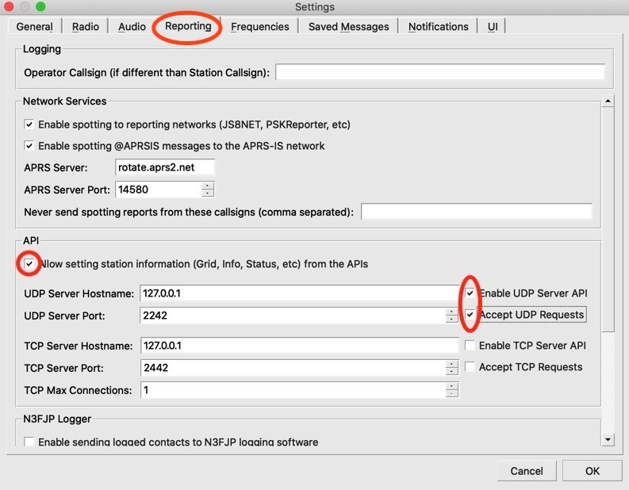
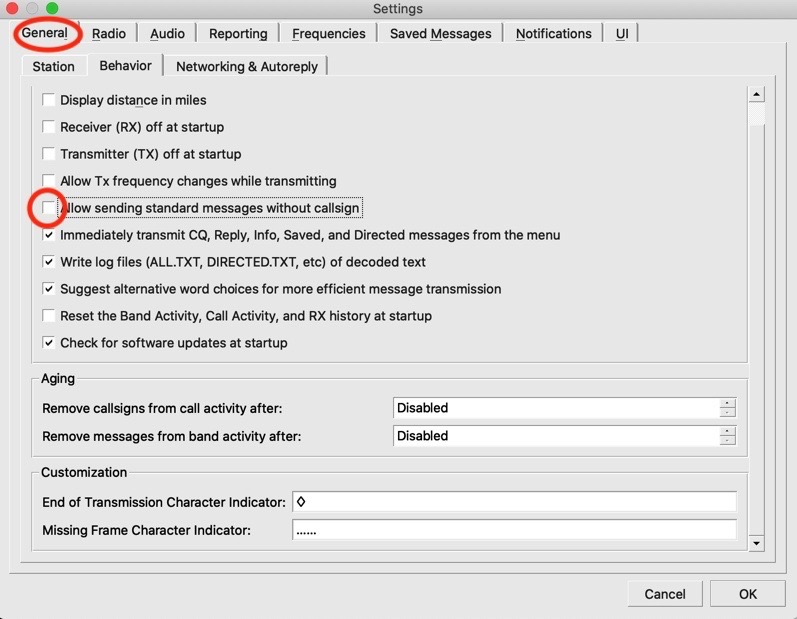

# NetControlJS8
A NodeJS/Electron cross-platform application to assist Net Control with JS8Call.
 
# Installation
Make sure you have a recent LTS version of Node.js. I was using Node.js v14.15.3 and NPM 6.14.10.

Clone this repository or download the zip file.

In the application folder install the dependencies:

$ npm install

To run the application:

$ npm start

This software has been tested with MacOS Catalina (10.15.6) and OS X El Capitan (10.11.6). 
Also with Windows 10, Linux Debian 10 and Ubuntu 20.04.1 LTS.

There may be an issue that has to be resolved manually after using NPM to install on Linux. See here:

https://github.com/electron/electron/issues/17972#issuecomment-487369441

# Notes
This application uses the UDP API of JS8Call version 2.2.0. It is important that the UDP 
port number in JS8Call matches the port number in this application which is currently
coded to be 2242. This is on the Reporting tab of the Settings dialog.

Also the setting to "Allow sending standard messages without callsign" should NOT be checked.

JS8Call can be found here:

http://files.js8call.com/latest.html

The use of this software is discussed in the following Groups.io topic:

https://groups.io/g/js8call/topic/net_communications_using_js8/79148254

and in the following document:

https://qsl.net/nf4rc/2021/ProposedNetCheckInProtocolV100.pdf 

A brief story about the history of this software can be read here:

https://rocketmanrc.com/netcontroljs8.html